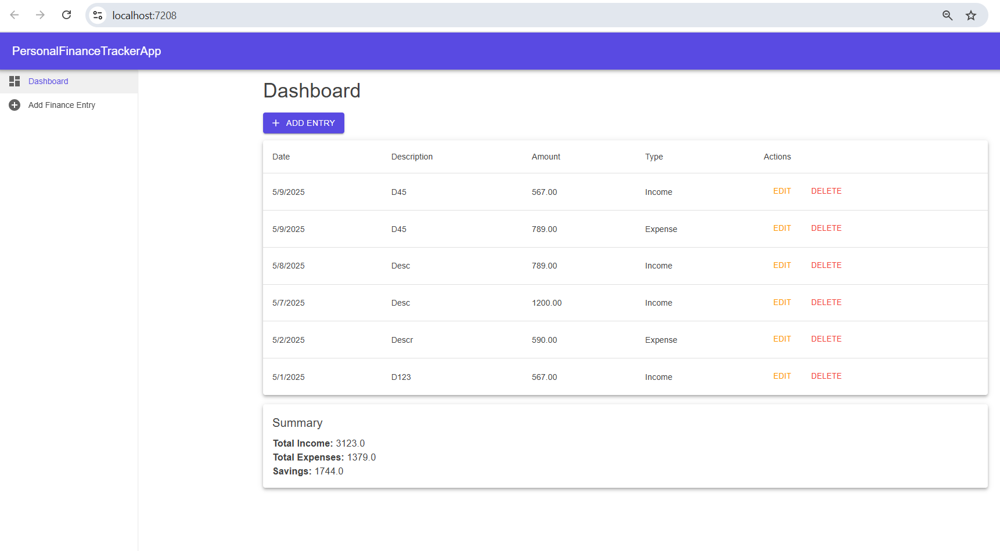
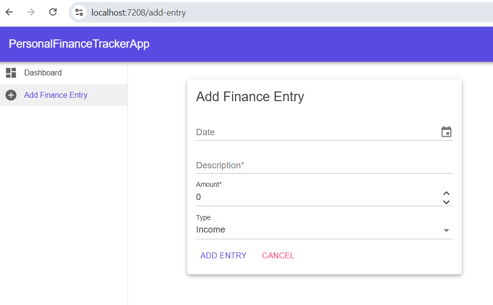

# Personal Finance Tracker

A Blazor Server application for tracking personal income and expenses. This project combines an ASP.NET Core Web API (using .NET 8) with Entity Framework Core (SQLite database) and a modern UI built with MudBlazor components. **Personal Finance Tracker** allows a user to log income and expense entries, edit or delete them, and view a dashboard summary of total income, expenses, and savings.

## Setup Instructions

### Prerequisites
- [.NET 8 SDK](https://dotnet.microsoft.com/en-us/download/dotnet/8.0) or newer
- Visual Studio 2022 or VS Code
- SQLite (no manual setup needed – database file auto-generates)

### Steps
1. Clone the repo: `git clone <repo-url>`
2. Navigate into the project folder: `cd PersonalFinanceTracker`
3. Restore packages: `dotnet restore`
4. Apply migrations: `dotnet ef database update`
- **Start both projects**:
  - Run `PersonalFinanceTracker.API` (backend API)
  - Run `PersonalFinanceTrackerApp` (Blazor Server UI)
  > ⚠️ **Both API and UI must be running at the same time** for the app to function correctly.
5. Run the app: `dotnet run`
6. Visit the app in your browser at `https://localhost:5001`

## Technology Choices and Reasoning

- **Blazor Server**: For interactive UI using C#; avoids client-side WebAssembly complexity.
- **ASP.NET Core Web API**: Clean separation of frontend and backend via REST.
- **EF Core with SQLite**: Lightweight, file-based database with full ORM support.
- **MudBlazor**: Material UI component library for fast, modern design without JavaScript.

## Architecture

- **Frontend**: Blazor Server (UI), using MudBlazor for components.
- **Backend**: ASP.NET Core API, exposing REST endpoints.
- **Database**: SQLite, managed via EF Core.

- **Service Layer**: Handles API communication in Blazor.

```
PersonalFinanceTracker/
├── PersonalFinanceTracker.API/     # ASP.NET Core Web API
│   ├── Controllers/
│   │   └── FinanceEntryController.cs
│   ├── Models/
│   │   └── FinanceEntry.cs
│   ├── Migrations/
│   └── AppDbContext.cs
│   └── Program.cs
├── PersonalFinanceTrackerApp/     # Blazor Server UI
│   ├── Models/
│   │   └── FinanceEntry.cs
│   ├── Pages/
│   │   ├── Dashboard.razor
│   │   └── AddEntry.razor
│   ├── Service/
│   │   └── FinanceEntryService.cs
│   ├── Shared/
│   │   └── MainLayout.razor
│   ├── Program.cs
```

## Assumptions

- Single-user app (no auth).
- One `.db` file for `FinanceEntry`.
- Inline edit allows only one entry in edit mode.

## Key Features

- Add/Edit/Delete income and expense entries.
- Inline editing within entry list.
- Dashboard showing Total Income, Total Expenses, and Savings.
- Full form validation - No future dates, required fields, and positive amounts validated on form.

## Bonus Features
- Error handling and validation messages.

## Screenshots

### Dashboard


### Add Entry Form
